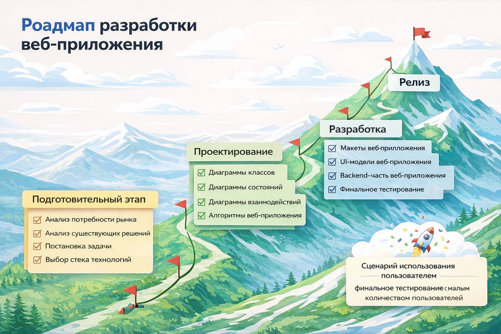

# 🏗️ Автоматизация интернет-магазина стройматериалов

Данный проект представляет собой систему по автоматизации взаимодействия между покупателем и продавцом в сфере торговли строительными материалами. Основная цель — создать удобный и интуитивно понятный сервис, который экономит время пользователя и упрощает управление бизнесом для продавца.

## 📋 Содержание
- [Цель проекта](#цель-проекта)
- [Критерии успеха](#критерии-успеха)
- [Функционал проекта](#функционал-проекта)
- [Выгода от реализации](#выгода-от-реализации)
- [Технологические ресурсы](#технологические-ресурсы)
- [Команда и роли](#команда-и-роли)
- [Сроки и роадмап](#сроки-и-роадмап)
- [Риски проекта](#риски-проекта)

## 🎯 Цель проекта
Продуманное и автоматизированное взаимодействие между пользователем (покупателем) и продавцом.

## ✅ Критерии успеха
- Соблюдение дедлайнов
- Правильная постановка задач

## ⚙️ Функционал проекта
- **Поиск по товарам**: Быстрый доступ к номенклатуре
- **Фильтрация товаров**: Сужение выборки по параметрам
- **Карточка товара**: Понятное описание и характеристики
- **Корзина пользователя**: Формирование заказа
- **Контакты**: Связь с продавцом
- **Система отзывов**: Обратная связь от клиентов

- **Логистика**: Управление поставками

## 💰 Выгода от реализации
**Для пользователя (покупателя):**
- Экономия времени на поиск стройматериалов
- Удобный интерфейс и быстрое оформление заказов

**Для продавца:**
- Упрощение поиска клиентской базы
- Прозрачная система остатков и логистики

## 📅 Сроки и роадмап
**Общая длительность проекта:** 16 недель

  

## ⚡ Риски проекта
1. **Технические риски**: Возникновение багов или сбоев сайта
2. **Риски безопасности**: Утечка личных данных пользователей
3. **Организационные риски**: Срыв сроков выполнения
4. **Риски качества**: Неудобство пользовательского интерфейса
5. **Внешние факторы**: Высокая конкуренция, потеря интереса аудитории
